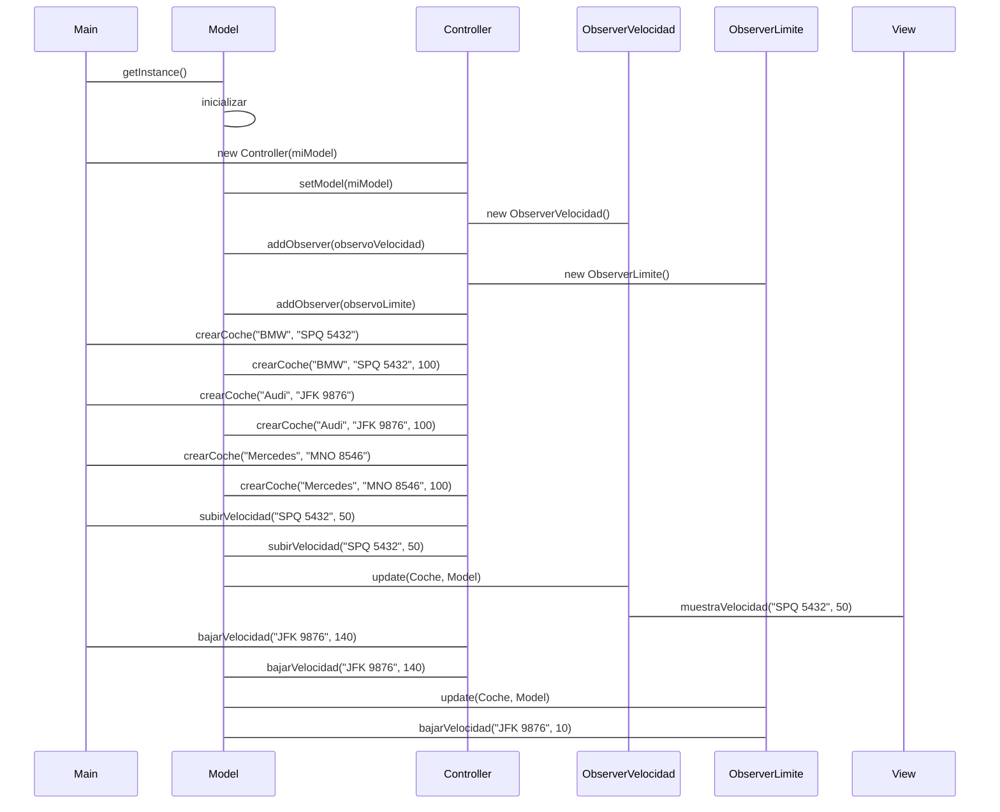

# Tarea: arquitectura MVC + Oberver 

Tarea para implementar arquitectura MVC

Utiliza objetos coches, modifica la velocidad y la muestra

---

## Clases ```Controller``` y ```Model```

- Implementa la clase ```Controller``` y ```Model``` según el diagrama de clases.

- Implementa los métodos ```crearCoche()```, ```getCoche()```, ```cambiarVelocidad()``` y ```getVelocidad()```

- Realiza los test necesarios para comprobar que funcionan correctamente

## NUEVO DIAGRAMA DE SECUENCIA

# Diagrama de secuencia

Este diagrama de secuencia muestra la interacción entre: `Main`, `Controller`, `Model`, `ObserverVelocidad`,`ObserverLimite`, y `View`. 

La secuencia de eventos comienza con la inicialización del modelo y la creación del controlador en la clase `Main`. 

Luego, se crean tres coches y se cambian sus velocidades utilizando los métodos `subirVelocidad` y `bajarVelocidad` del controlador. 

Los observadores `ObserverVelocidad` y `ObserverLimite` se encargan de notificar los cambios de velocidad y aplicar las 

reglas de velocidad máxima y mínima, respectivamente. 

Por último, la vista `View` muestra la velocidad actualizada de los coches.


## NUEVO DIAGRAMA DE CLASES

```mermaid
classDiagram
    Main
      - main(String[] args)
      - Model miModel
      - Controller miController
    
    Controller
      - Model miModel
      - ObserverVelocidad observoVelocidad
      - ObserverLimite observoLimite
      - crearCoche(String, String)
      - subirVelocidad(String, Integer)
      - bajarVelocidad(String, Integer)
    
    Model
      - getInstance()
      - crearCoche(String, String, Integer)
      - subirVelocidad(String, Integer)
      - bajarVelocidad(String, Integer)
      - addObserver(Observer)
      - notifyObservers()
    
    Observer
      - update(Coche, Model)
    
    ObserverVelocidad
      - update(Coche, Model)
      - View
    
    ObserverLimite
      - update(Coche, Model)
      - Model
    
    View
      - muestraVelocidad(String, Integer)
    
    Coche
      - String matricula
      - String nombre
      - Integer velocidad
```