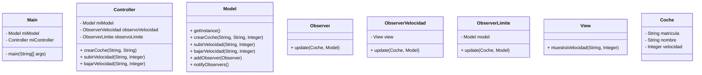

# Tarea: arquitectura MVC + Oberver 

Tarea para implementar arquitectura MVC

Utiliza objetos coches, modifica la velocidad y la muestra

---

## Clases ```Controller``` y ```Model```

- Implementa la clase ```Controller``` y ```Model``` según el diagrama de clases.

- Implementa los métodos ```crearCoche()```, ```getCoche()```, ```cambiarVelocidad()``` y ```getVelocidad()```

- Realiza los test necesarios para comprobar que funcionan correctamente

## NUEVOS DIAGRAMAS
Para crear estos diagramas he empleado UML con ayuda de los diagramas creados anteriormente y luego he pasado el código
UML a MD para el correcto formateo de este documento. El código UML es como el MD y se emplea para hacer diagramas,
es más sencillo y rápido que hacerlo desde `draw.io` porque no se hace todo a mano, solo hay que tener el código UML
bien hecho y el gráfico se genera solo.

### NUEVO DIAGRAMA DE CLASES
Este diagrama de secuencia muestra la interacción entre: `Main`, `Controller`, `Model`, `ObserverVelocidad`,`ObserverLimite`, y `View`. 

La secuencia de eventos comienza con la inicialización del modelo y la creación del controlador en la clase `Main`. 

Luego, se crean tres coches y se cambian sus velocidades utilizando los métodos `subirVelocidad` y `bajarVelocidad` del controlador. 

Los observadores `ObserverVelocidad` y `ObserverLimite` se encargan de notificar los cambios de velocidad y aplicar las 

reglas de velocidad máxima y mínima, respectivamente. 

Por último, la vista `View` muestra la velocidad actualizada de los coches.


### NUEVO DIAGRAMA DE CLASES
